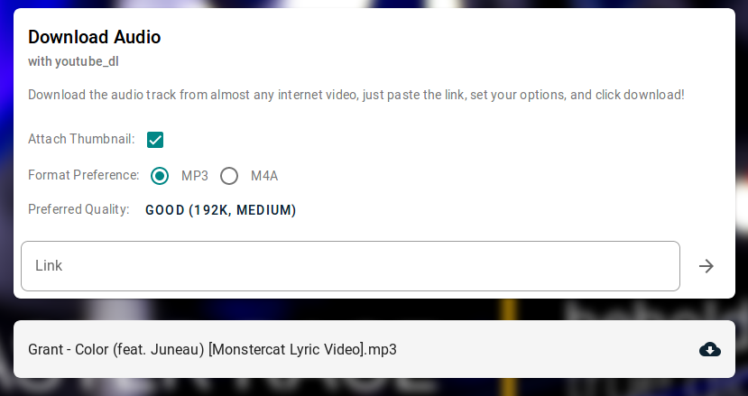

# HomePage

HomePage is a trivial flask web app that allows downloading the audio track from almost any internet video.
It is intended to be deployed inside a private network for personal use, so that hosts within the network can access
and download the tracks they want.

HomePage is very basic, but it has a simple and easy to use front-end.
HomePage uses `youtube_dl` to download the videos, so quite a few sites are supported. Playlists are also supported.
[`youtube_dl`](https://github.com/ytdl-org/youtube-dl/) has been taken down due to a copyright strike, but this does not impact the PyPi version, so this will work as normal.



## Prerequsites

- `python 3.6` or above with `pip`
- `sudo` access (for port 80)
- `pyenv` and `poetry` installed (optional)
- `apt` package manager & package lists

## Install

The basic installation is very simple.

```bash
$ python3 -m pip install --user homepage

# Normal desktop
$ homepage -i

# Server without x11
$ homepage -ic
```

Then, you can deploy with:

```bash
$ homepage -dfp
```

Alternatively, if your system is running an older version of python or you wish to run this project inside
a virtual environment, you can do that too.

First, go ahead and install [pyenv](https://github.com/pyenv/pyenv#basic-github-checkout). Then install [poetry](https://github.com/sdispater/poetry).
Once you've installed those, we just to install a few more things.

```bash
$ git clone https://github.com/Sh3llcod3/HomePage.git
$ cd HomePage/
$ pyenv install 3.9.0
$ pyenv local 3.9.0
$ poetry poetry self update --preview
$ poetry update
$ poetry install # Add --no-dev if you don't want dev deps
$ poetry shell
$ homepage -ip
$ homepage -df
```

After installing `pyenv`, the lines you add to your `~/.bashrc` may need to be different, please see the [FAQ](#faq--troubleshooting).

## Uninstall

If you installed using `pip`:

```shell
python3 -m pip uninstall -y homepage easyparse Flask youtube_dl gevent
```

and it will remove this completely from your system. You can vary this command based on what you want to keep.

Otherwise, if you've installed using poetry and assuming you're inside the current directory:

```shell
$ exit # Exit virtualenv or press Ctrl-d
$ poetry env remove 3.9
$ poetry cache clear --all pypi
$ cd .. && rm -rf HomePage/
```

## Usage

Once deployed, if you're using this on the device which is hosting it, fire up your
favourite web browser and head to `http://localhost:5000/`. If you're on another device,
simply head to the IP address of the host node.

If you have `sudo` access, use the `-f` switch. If you don't, port 80 will not be used.

> Playlists are supported and all sites that will with ytdl will also work here.

## FAQ & Troubleshooting

#### I'm having trouble with the env

You may have inserted the wrong lines in your `~/.bashrc`.
The initialization lines shown on the pyenv repo don't work
well with poetry. Instead, add these lines to the end of the file
and remove any previous lines you may have added before
(taking care to ensure you don't remove anything else).

```bash
# Pyenv installation

if [[ -z "$VIRTUAL_ENV" ]]; then
    export PATH="$HOME/.pyenv/bin:$PATH"
    eval "$(pyenv init -)"
fi
```

#### Can I change the background?

You absolutely can. To change the background, change out `homepage/static/Background.jpg` with any image you like,
but it has to be called `Background.jpg` and in the `JPEG` format. I will make this process easier in the future.

#### Pyenv fails to install 3.9.0

You may have forgotten to install some crucial `pyenv` dependencies.
If you're using other package managers, check [here](https://github.com/pyenv/pyenv/wiki#suggested-build-environment)
for their wiki page. If you're using `apt`, you can simply run:

```bash
$ sudo apt update
$ sudo apt-get install -y --no-install-recommends make build-essential libssl-dev zlib1g-dev libbz2-dev libreadline-dev libsqlite3-dev wget curl llvm libncurses5-dev xz-utils tk-dev libxml2-dev libxmlsec1-dev libffi-dev liblzma-dev
```

Then retry the `pyenv` installation.

#### Why does HomePage exist?

That is a really good question.
I wanted a simple web app where I could download music from various videos on any
device, without having access to a command line version of `youtube_dl` or resorting
to using questionable sites and apps.

The code is bad at best, but it works and you have the freedom of choice.
Whether you want to use it, is up to you.

#### Why is it not working?

Your version of `youtube_dl` may be out of date. Having a version of `youtube_dl`
that is even one version old can mean your tracks may fail to download. Fortunately,
the library is updated frequently and you can pull in the updates very easily.

If you're using it from PyPi, then:
```shell
$ python3 -m pip install --upgrade youtube_dl gevent Flask --user
$ youtube-dl --rm-cache-dir
```

If you're using it from the `env`, then simply `cd` to the directory you installed it
and run:
```shell
$ poetry update
$ poetry shell
```

> You may want to write some sort of `cron` job to do this every few days or so.

#### Does HomePage scale to multiple users asynchronously?

No. It was never intended to scale in the first place. Neither is it secure in any way.
Therefore, I should stress that you should __NOT__ deploy this to anywhere except your
RFC1918 private/internal network with caution.

#### Does it have Windows support?

Yes. If you can get the latest executables for `lame`, `atomicparsley`, `faac`, `ffmpeg` and
place them inside the project's directory, it should work.

#### Why does it take long?

This depends on:

- Speed of computer and version of ffmpeg
- Size of download, network speed
- Single track or playlist?

## To-do

- [ ] Add auth
- [ ] Replace xhr with websocket
- [ ] Save user preferences using cookies
- [ ] Display past tracks only for that user
- [ ] Add management card
- [ ] Make it work on windows and generate executables
